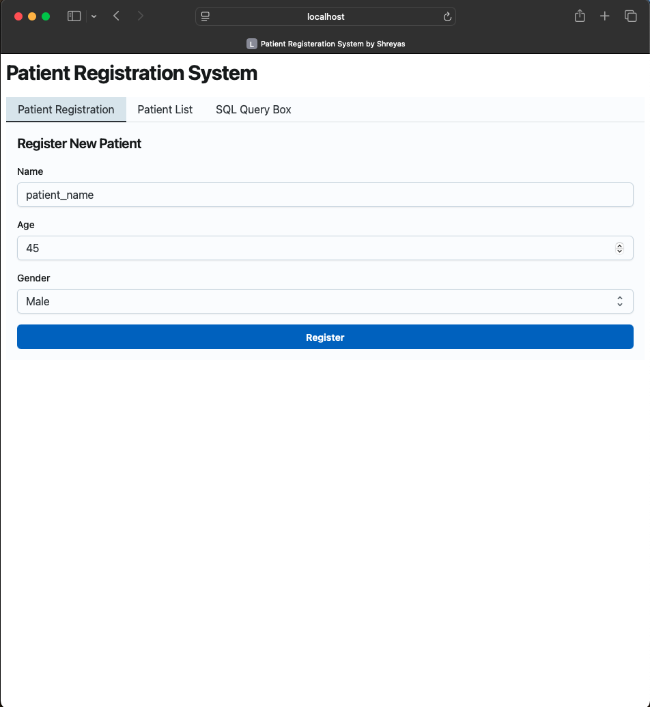
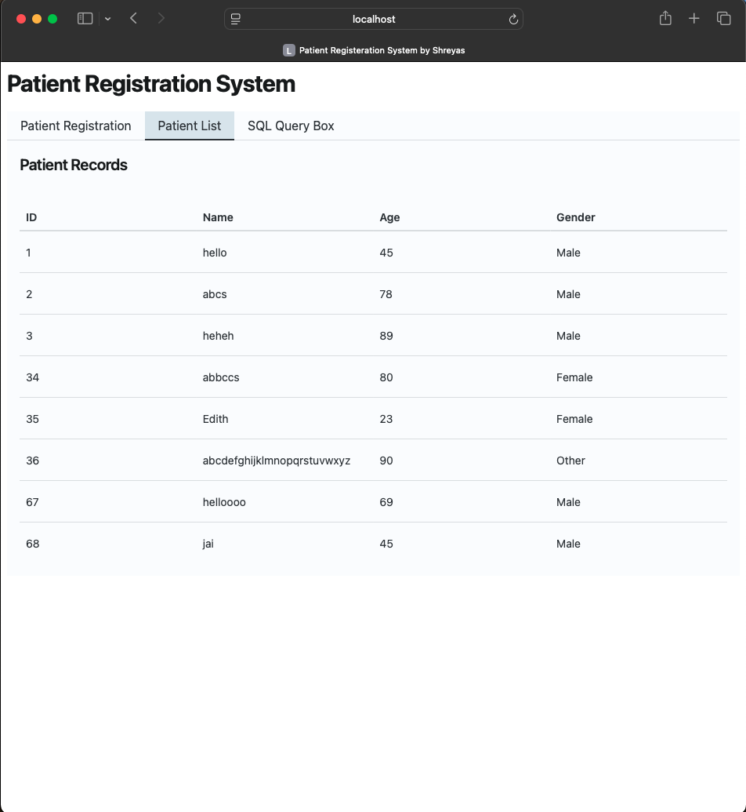
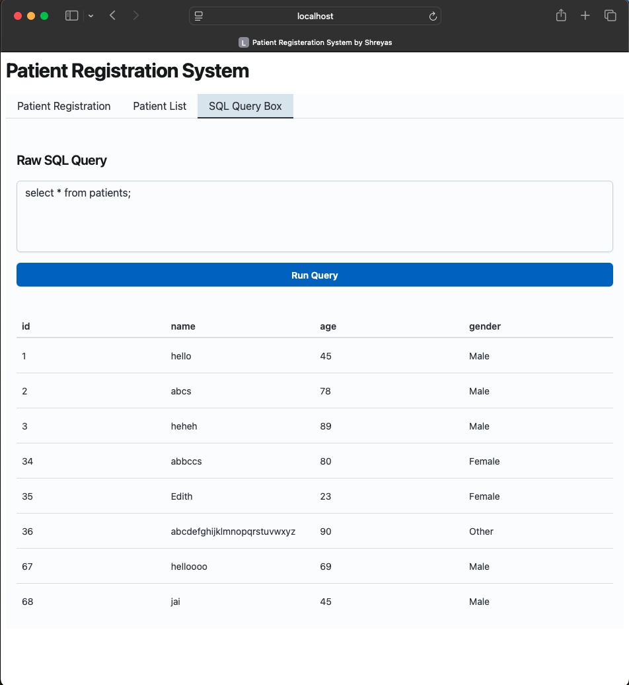

# Patient Registration System - User Manual

Welcome to the Patient Registration System! This guide will help you navigate the app, register patients, view patient lists, and run SQL queries with ease.

---

## Table of Contents

- [Quick Start Guide](#quick-start-guide)  
- [Features Overview](#features-overview)  
- [Using the Patient Registration Tab](#using-the-patient-registration-tab)  
- [Using the Patient List Tab](#using-the-patient-list-tab)  
- [Using the SQL Query Box Tab](#using-the-sql-query-box-tab)  
- [Working with Multiple Tabs or Windows](#working-with-multiple-tabs-or-windows)  
- [Tips & Best Practices](#tips--best-practices)  
- [Troubleshooting & FAQs](#troubleshooting--faqs)  
- [Contact & Support](#contact--support)  

---

## Quick Start Guide

1. Open the app in a modern browser (Chrome, Firefox, Edge, Safari 15.4+, or supported mobile browsers).  
2. Use the **Patient Registration** tab to add new patients.  
3. Switch to the **Patient List** tab to see all registered patients.  
4. Use the **SQL Query Box** tab for advanced queries if needed.  
5. Open multiple tabs or windows to see real-time sync in action.

---

## Features Overview

- **Patient Registration:** Simple form to add new patients.  
- **Patient List:** View and automatically refresh the list of patients.  
- **SQL Query Box:** Run custom SQL queries on the local database.  
- **Multi-tab Sync:** Changes sync instantly across tabs/windows.  

---

## Using the Patient Registration Tab

1. Click the **Patient Registration** tab.  
2. Fill in the form fields:  
   - **Name:** Enter full patient name.  
   - **Age:** Enter age as a number.  
   - **Gender:** Select from dropdown.  
3. Click **Submit**.  
4. Form clears on success; patient list updates across all tabs.

---

## Using the Patient List Tab

- View all registered patients with their details.  
- List updates automatically when patients are added in any tab.  
- No manual refresh needed.

---

## Using the SQL Query Box Tab

- Enter any valid SQL query to run against the database.  
- Example: `SELECT * FROM patients WHERE age > 25;`  
- Click **Run** to execute and view results.  
- Use with caution; improper queries may cause errors.

---

## Working with Multiple Tabs or Windows

- Open the app in multiple tabs or windows of the **same browser**.  
- Register patients in one tab; patient lists in other tabs update instantly.  
- Sync uses the browser’s BroadcastChannel API.  
- Ensure all tabs use the exact same URL (protocol, domain, port).

---

## Tips & Best Practices

- Use modern browsers for best performance and compatibility.  
- Avoid running destructive SQL queries unless you understand the consequences.  
- Keep patient names consistent to avoid duplicates.  
- Refresh the page if you encounter unexpected behavior.  
- Use the SQL Query Box for advanced data analysis or troubleshooting.

---

## Troubleshooting & FAQs

### Q: The patient list doesn't update in another browser or device. Why?

- Sync works only within the **same browser** and origin. Different browsers or devices do not sync automatically.

### Q: I get errors running SQL queries. What should I do?

- Double-check your SQL syntax.  
- Use simple SELECT queries if unsure.  
- Avoid DROP or DELETE queries unless necessary.

### Q: Can I use the app offline?

- Yes, data is stored locally in your browser and persists across sessions.  
- Sync and multi-tab features work only when tabs are open in the same browser.

### Q: Which browsers are supported?

- Chrome 54+, Firefox 38+, Edge 79+, Safari 15.4+, and their mobile versions.

---

## Contact & Support

For additional help, feature requests, or to report bugs:

- Contact your system administrator or developer.  
- Open an issue on the project’s GitHub repository: [https://github.com/yourusername/patient-registration/issues](https://github.com/yourusername/patient-registration/issues)

---

Thank you for using the Patient Registration System!

---

